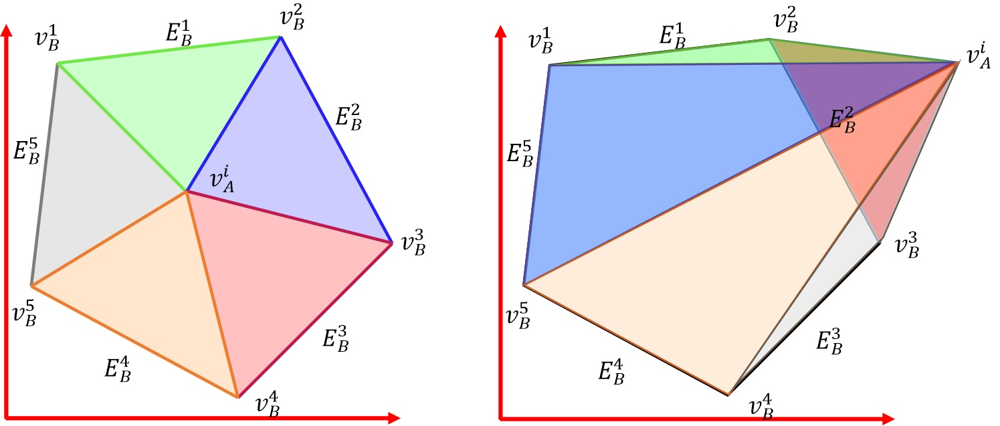

# Polygon-to-Polygon Distance Loss for Rotated Object Detection



## Introduction
The repo is based on [S<sup>2</sup>A-Net](https://github.com/csuhan/s2anet) and [mmdetection](https://github.com/open-mmlab/mmdetection). Thanks to the original authors!


## Abstract
  There are two key issues that limit further improvements in the performance of existing rotational detectors: 1)Periodic sudden change of the parameters in the rotating bounding box (RBBox) definition causes a numerical discontinuity in the loss (such as smoothL1 loss). 2)There is a gap of optimization asynchrony between the loss in the RBBox regression and evaluation metrics. In this paper, we define a new distance formulation between two convex polygons describing the overlapping degree and non-overlapping degree. Based on this smooth distance, we propose a loss called Polygon-to-Polygon distance loss (P2P Loss). The distance is derived from the area sum of triangles specified by the vertexes of one polygon and the edges of the other. Therefore, the P2P Loss is continuous, differentiable, and inherently free from any RBBox definition. Our P2P Loss is not only consistent with the detection metrics but also able to measure how far, as well as how similar, a RBBox is from another one even when they are completely non-overlapping. These features allow the RetinaNet using the P2P Loss to achieve 79.15$\%$ mAP on the DOTA dataset, which is quite competitive compared with many state-of-the-art rotated object detectors.

## Benchmark and model zoo
*All results are reported on DOTA-v1.0 *test-dev*. 

### Baseline

|Method          |Model          |    Backbone     |    MS  |  Rotate | box AP | Download|
|:-------------:|:-------------:| :-------------: | :-----:| :-----: | :----: | :---------------------------------------------------------------------------------------: |
|SmoothL1      |RetinaNet      |    R-50-FPN     |   -     |   -    |  69.41/69.92/69.88 |        [model](https://hanks-my.sharepoint.com/:u:/g/personal/dishofchicken_hanks_onmicrosoft_com/EZOwq38WQuVFoO5Kg1-x69MB6Nu7tCvz5I7LWubDRaQGhA?e=oKemoQ)/[model](https://hanks-my.sharepoint.com/:u:/g/personal/dishofchicken_hanks_onmicrosoft_com/EatswED04gNNgZ5nlnDiOk8B8rUBgb8vC7y_4K1GYZhVZg?e=juWlrJ)/[model](https://hanks-my.sharepoint.com/:u:/g/personal/dishofchicken_hanks_onmicrosoft_com/ETMozh4qwEtKgKt0qtpsaqkBbEGbFYdjG8kTC9UJ1hILmA?e=KDdMdd)|
|P2P Loss      |RetinaNet         |    R-50-FPN     |   -     |  -     |  70.89/70.91/71.05 |    [model](https://hanks-my.sharepoint.com/:u:/g/personal/dishofchicken_hanks_onmicrosoft_com/EXDQgOIdhAlOimKV1sl6ApABjmVqCS-qu8hX2lx3XCxJyA?e=upaGVh)/[model](https://hanks-my.sharepoint.com/:u:/g/personal/dishofchicken_hanks_onmicrosoft_com/EWfFxFUV0HJPtjFEuJn8B8IBqrImE0ZDrxvZRj5A3orWiw?e=ZO5lMv)/[model](https://hanks-my.sharepoint.com/:u:/g/personal/dishofchicken_hanks_onmicrosoft_com/EXqFFQhpXvhHoNNyvv6AQG4BRst9ydKxWQHthIjvE-fVGA?e=GQsQMa)    |
|P2P Loss#      |RetinaNet         |    R-50-FPN    |   -     |  -     |  72.38/72.21/72.20 |    [model](https://hanks-my.sharepoint.com/:u:/g/personal/dishofchicken_hanks_onmicrosoft_com/EddCWOBOS3VAnnFbLIcx-8kB5DUfnWq2-ScafoQzFLkT6Q?e=QXBQ4H)/[model](https://hanks-my.sharepoint.com/:u:/g/personal/dishofchicken_hanks_onmicrosoft_com/Eev9AUbzDv9Ai-QFM6a7CqYBORpMUpBu81D08QzeVrxgUA?e=WUfeaF)/[model](https://hanks-my.sharepoint.com/:u:/g/personal/dishofchicken_hanks_onmicrosoft_com/EXieBohDtrpIpk960OOQFSUBiV-Zv7-__rkN3W4lqSMRZA?e=KSJiLQ)            |
|P2P Loss#      |RetinaNet         |    R-50-FPN    |   ✓     |  ✓     |  78.308 |    [model](https://hanks-my.sharepoint.com/:u:/g/personal/dishofchicken_hanks_onmicrosoft_com/Ee3sT3NGrklMv_pkumCYDUsBCw8uKikIzY-NpxZz8a9rFw?e=z8vtZV)            |
|P2P Loss#      |RetinaNet         |    R-101-DCN    |   ✓     |  ✓     |  79.155 |    [model](https://hanks-my.sharepoint.com/:u:/g/personal/dishofchicken_hanks_onmicrosoft_com/EfIjN64vDwlOg6j4pTPUzsgBLp9IebEpA4kir8C3WK6FCA?e=BsKRNK)            |


## Installation

Please refer to [install.md](docs/INSTALL.md) for installation and dataset preparation.


## Getting Started

Please see [getting_started.md](docs/GETTING_STARTED.md) for the basic usage of MMDetection.


## Citation

```
@article{yang2022polygon,
  title={Polygon-to-Polygon Distance Loss for Rotated Object Detection},
  author={Yang, Yang and Chen, Jifeng and Zhong, Xiaopin and Deng, Yuanlong},
  year={2022}
}

@article{han2020align,
  title = {Align Deep Features for Oriented Object Detection},
  author = {Han, Jiaming and Ding, Jian and Li, Jie and Xia, Gui-Song},
  journal = {arXiv preprint arXiv:2008.09397},
  year = {2020}
}

@inproceedings{xia2018dota,
  title={DOTA: A large-scale dataset for object detection in aerial images},
  author={Xia, Gui-Song and Bai, Xiang and Ding, Jian and Zhu, Zhen and Belongie, Serge and Luo, Jiebo and Datcu, Mihai and Pelillo, Marcello and Zhang, Liangpei},
  booktitle={Proceedings of the IEEE Conference on Computer Vision and Pattern Recognition},
  pages={3974--3983},
  year={2018}
}

@InProceedings{Ding_2019_CVPR,
  author = {Ding, Jian and Xue, Nan and Long, Yang and Xia, Gui-Song and Lu, Qikai},
  title = {Learning RoI Transformer for Oriented Object Detection in Aerial Images},
  booktitle = {The IEEE Conference on Computer Vision and Pattern Recognition (CVPR)},
  month = {June},
  year = {2019}
}

@article{chen2019mmdetection,
  title={MMDetection: Open mmlab detection toolbox and benchmark},
  author={Chen, Kai and Wang, Jiaqi and Pang, Jiangmiao and Cao, Yuhang and Xiong, Yu and Li, Xiaoxiao and Sun, Shuyang and Feng, Wansen and Liu, Ziwei and Xu, Jiarui and others},
  journal={arXiv preprint arXiv:1906.07155},
  year={2019}
}
```
